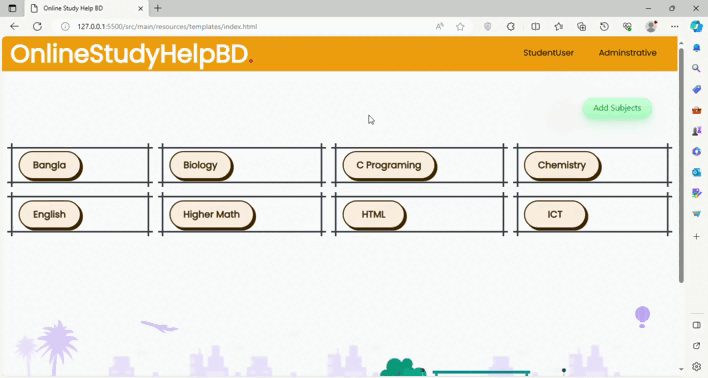
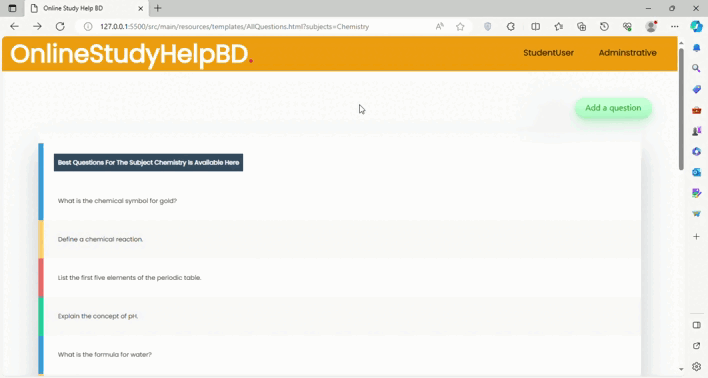

# OnlineStudeyHelpBD-A-SpringBoot-Project

**This is a Spring Boot Learning project**

**OnlineStudyHelpBD**

```
OnlineStudyHelpBD is a website where students can ask their subjectwise most difficult questions.
```

# Project Description


# Technology Used
My project relies on the following technologies, libraries, and tools:


### Backend
- [](https://www.java.com): The core programming language.
- [](https://spring.io/projects/spring-framework): A comprehensive framework for Java development.
- [](https://spring.io/projects/spring-boot): A project within the Spring ecosystem, simplifying the setup and development of Spring applications.

### Build Tools
- [](https://maven.apache.org): A popular build automation and project management tool.

### Web Server
- [](http://tomcat.apache.org): A widely used web server and servlet container.

### Database
- [](https://www.mysql.com): A robust relational database management system.

### Version Control
- [](https://github.com): A web-based platform for version control using Git.

### Integrated Development Environment (IDE)
- [](https://code.visualstudio.com): A lightweight and powerful source code editor.

### Frontend Technologies
- [](https://developer.mozilla.org/en-US/docs/Web/HTML): Markup language for creating the structure of web pages.
- [](https://developer.mozilla.org/en-US/docs/Web/CSS): Stylesheet language for designing the presentation of web pages.
- [](https://developer.mozilla.org/en-US/docs/Web/JavaScript): Programming language for adding interactivity to web pages.

### Java Web Technologies
- [](https://docs.spring.io/spring-framework/docs/current/reference/html/web.html): A web module of the Spring Framework for building web applications.
- [](https://restfulapi.net): Architectural style for creating web services, implemented using Java.

### Java Database Connectivity (JDBC)
- [](https://docs.oracle.com/en/java/javase/14/docs/api/java.sql/java/sql/package-summary.html): Utilized for connecting Java applications to the MySQL database.


# Home Page
                

```
Home page before and after login
```

# All Questions Page 



```
By clicking on a subject studens or Admin can enter all the available questions
of this subject
```

# Ask A Quesion



```
Student can ask questions which they felt are very difficult to answer
```
# Student Login


# Admin Login


# Spring boot Learning notes
```
**As it was mentioned earlier this was a spring boot learning project**
```
## My Spring boot Project Structures


```plaintext
src
|-- main
|   |-- java
|   |   `-- com
|   |       `-- example
|   |           `-- OnlineStudyHelp
|   |               |-- controller
|   |               |   |-- Controllers.java
|   |               |-- model
|   |               |   |-- Questions.java
|   |               |   |-- Subjectadded.java
|   |               |   |-- Loginadmin.java
|   |               |   |-- LoginUser.java
|   |               |-- repository
|   |               |   |-- LoginadminRepository.java
|   |               |   |-- LoginUserRepository.java
|   |               |   |-- QuestionsRepository.java
|   |               |   |-- SubjectaddedRepository.java
|   |               |-- service
|   |               |   |-- LoginadminService.java
|   |               |   |-- LoginUserService.java
|   |               |   |-- QuestionsService.java
|   |               |   |-- SubjectaddedService.java
|   |               |-- utility
|   |               |   |-- Confirmation.java
|   |               |   |-- Person.java
|   |               |   |-- QuestionRequest.java
|   |               |-- OnlineStudyApplication.java
|   |
|   |-- resources
|   |   |-- application.properties (Contains database connections)
|   |   |-- static
|   |   |   |-- css
|   |   |   |   `-- style.css
|   |   |   |-- js
|   |   |   |   `-- script.js
|   |   |   `-- images
|   |   |       `-- logo.png
|   |   |
|   |   |-- templates
|   |   |   `-- index.html
|   |   |   `-- other html files
|   `-- webapp (optional)
|       `-- WEB-INF
|
|-- test
|   |-- java
|   |   `-- com
|   |       `-- example
|   |           `-- myproject
|   |               |-- controller
|   |               |   `-- MyControllerTest.java
|   |               |-- service
|   |               |   `-- MyServiceTest.java
|   |               `-- MyProjectApplicationTests.java
|
`-- target
```


