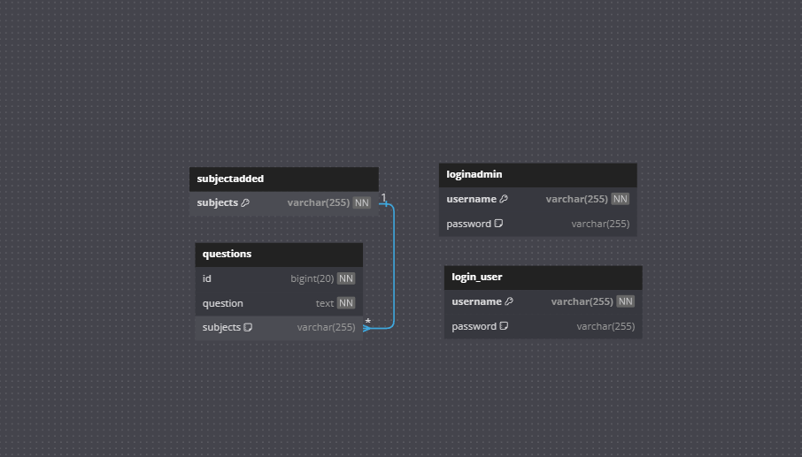

# OnlineStudeyHelpBD-A-SpringBoot-Project

**This is a Spring Boot Learning project. I learned about spring boot and did this project in one day**
**Very beginner friendly**

**OnlineStudyHelpBD**

```
OnlineStudyHelpBD is a website where students can ask their subjectwise most difficult questions.
```

# Project Description


# Technology Used
My project relies on the following technologies, libraries, and tools:


### Backend
- [](https://www.java.com): The core programming language.
- [](https://spring.io/projects/spring-framework): A comprehensive framework for Java development.
- [](https://spring.io/projects/spring-boot): A project within the Spring ecosystem, simplifying the setup and development of Spring applications.

### Build Tools
- [](https://maven.apache.org): A popular build automation and project management tool.

### Web Server
- [](http://tomcat.apache.org): A widely used web server and servlet container.

### Database
- [](https://www.mysql.com): A robust relational database management system.

### Version Control
- [](https://github.com): A web-based platform for version control using Git.

### Integrated Development Environment (IDE)
- [](https://code.visualstudio.com): A lightweight and powerful source code editor.

### Frontend Technologies
- [](https://developer.mozilla.org/en-US/docs/Web/HTML): Markup language for creating the structure of web pages.
- [](https://developer.mozilla.org/en-US/docs/Web/CSS): Stylesheet language for designing the presentation of web pages.
- [](https://developer.mozilla.org/en-US/docs/Web/JavaScript): Programming language for adding interactivity to web pages.

### Java Web Technologies
- [](https://docs.spring.io/spring-framework/docs/current/reference/html/web.html): A web module of the Spring Framework for building web applications.
- [](https://restfulapi.net): Architectural style for creating web services, implemented using Java.

### Java Database Connectivity (JDBC)
- [](https://docs.oracle.com/en/java/javase/14/docs/api/java.sql/java/sql/package-summary.html): Utilized for connecting Java applications to the MySQL database.


# Home Page


```
Home page after and before login
```

# All Questions Page 


```
By clicking on a subject studens or Admin can enter all the available questions
of this subject
```

# Ask A Quesion


```
Student can ask questions which they felt are very difficult to answer
```
# Student Login


# Admin Login


# Database schema


# Spring boot Learning notes
```
**As it was mentioned earlier this was a spring boot learning project**
```


## Spring boot Project Structures


1. **src/main/java**: This directory contains your main Java source code.

   - **com.example.demo**: This is often the package structure for your project. The package name is usually in reverse domain format. For example, if your domain is example.com, your package might be com.example.

     - **Application.java**: This is the entry point of your Spring Boot application. It contains the `main` method and is annotated with `@SpringBootApplication`, which is a convenience annotation that adds various configuration classes.

2. **src/main/resources**: This directory contains non-Java resources, such as application properties, XML configuration files, static content, templates, etc.

   - **application.properties or application.yml**: Configuration files where you can set various properties for your application, like server port, database connection details, etc.

   - **static/**: This directory is used for static resources such as CSS, JavaScript, images, etc.

   - **templates/**: This directory is used for HTML templates if you are using a template engine like Thymeleaf.

3. **src/test**: This directory contains your test code.

   - **com.example.demo**: This mirrors the structure of the main source code, and you will find test classes here to test your application.

4. **pom.xml (Maven)** or **build.gradle (Gradle)**: This is the project configuration file where you specify dependencies, plugins, and other build-related settings.

5. **target (or build) directory**: This is the default output directory for compiled classes and generated JAR or WAR files.

6. **mvnw and mvnw.cmd (or gradlew and gradlew.bat)**: These are wrapper scripts for Maven or Gradle, respectively. They allow you to run your project without having to install Maven or Gradle separately.

7. **.gitignore**: This file specifies intentionally untracked files that Git should ignore.

8. **README.md**: A markdown file providing information about the project, including instructions for building and running it.

9. **.editorconfig**: A configuration file to define and maintain consistent coding styles between different editors and IDEs.

10. **.git**: The directory that contains the configuration, objects, and refs for a Git repository.

11. **.mvn**: Maven wrapper directory, contains wrapper files for Maven similar to the mvnw script.

12. **.settings**: IDE-specific settings, e.g., for Eclipse.

Remember that the structure can vary based on your specific requirements, and additional directories may be present based on the complexity and needs of your project. Also, the actual file names and contents may vary based on the tools and libraries you are using.

# Model-View-Controller (MVC) architectural pattern

## 1. Controller classes:
   - **Purpose:** Controllers in Spring Boot handle incoming HTTP requests, process them, and return appropriate responses.API CAlls
   - **Location:** Controllers are often placed in a package like `com.example.controller`.
   - **Example:**

```java
// TaskController.java
import org.springframework.beans.factory.annotation.Autowired;
import org.springframework.http.HttpStatus;
import org.springframework.http.ResponseEntity;
import org.springframework.web.bind.annotation.*;

import java.util.List;

@RestController
@RequestMapping("/tasks")
public class TaskController {

    @Autowired
    private TaskRepository taskRepository;

    // Create a new task
    @PostMapping  // if this has no id just hitting on task by a post request will return this
    public ResponseEntity<Task> createTask(@RequestBody Task task) {
        Task createdTask = taskRepository.save(task);
        return new ResponseEntity<>(createdTask, HttpStatus.CREATED);//return type is json
    }

    // Get all tasks
    @GetMapping("All")  // hit should be like /tasks/All
    public ResponseEntity<List<Task>> getAllTasks() {
        List<Task> tasks = (List<Task>) taskRepository.findAll();
        return new ResponseEntity<>(tasks, HttpStatus.OK);
    }

    // Get a task by ID
    @GetMapping("/{id}")     // if hit is tasks/1235 then id = 1235
    public ResponseEntity<Task> getTaskById(@PathVariable Long id) {
        Task task = taskRepository.findById(id)
                .orElseThrow(() -> new RuntimeException("Task not found with id " + id));
        return new ResponseEntity<>(task, HttpStatus.OK);
    }

    // Update a task by ID
    @PutMapping("/{id}")
    public ResponseEntity<Task> updateTask(@PathVariable Long id, @RequestBody Task updatedTask) {
        Task existingTask = taskRepository.findById(id)
                .orElseThrow(() -> new RuntimeException("Task not found with id " + id));

        existingTask.setDescription(updatedTask.getDescription());

        Task savedTask = taskRepository.save(existingTask);
        return new ResponseEntity<>(savedTask, HttpStatus.OK);
    }

    // Delete a task by ID
    @DeleteMapping("/{id}")          //path variable are used to get id from path
    public ResponseEntity<Void> deleteTask(@PathVariable Long id) {
        taskRepository.deleteById(id);
        return new ResponseEntity<>(HttpStatus.NO_CONTENT);
    }
}
```

## 2. Model:
*Model entities are often associated with a database and are used to model the data you want to store and manipulate.*
   - **Purpose:** The term "Model" can be a bit ambiguous. In the context of Spring Boot, it often refers to the domain entities or DTOs (Data Transfer Objects) that represent the data structure of your application.
   - **Location:** Models are typically located in a package like `com.example.model`.
   - **Example:**
```java
     @Entity
     public class StudentInfo {
         @Id
         @GeneratedValue(strategy = GenerationType.IDENTITY)
         private Long id;
	 private String name;
	 private String age;

         // Other fields and methods
     }
```


## 3. Repository Interfaces:

In Spring Data JPA, a repository interface is an interface that extends one of the Spring Data repository interfaces. These interfaces provide a set of methods for performing common database operations without the need for boilerplate code. The repository interfaces are typically extended by your custom repository interfaces, and Spring Data JPA dynamically generates the implementation at runtime.
   
   - **Purpose:** Repositories provide an abstraction layer for data access, allowing the application to interact with a database without being tied to a specific data storage technology.
   - **Location:** Repository interfaces are often placed in a package like `com.example.repository`.
   - **Example:**
```java
import org.springframework.data.jpa.repository.JpaRepository;
import java.util.List;

public interface UserRepository extends JpaRepository<User, Long> {

    // Find user by username
    List<User> findByUsername(String username);

    // Find user by subject
    List<User> findBySubject(String subject);

    // Custom query to find users by both username and subject
    List<User> findByUsernameAndSubject(String username, String subject);

    // Custom query to find users by username containing a keyword
    List<User> findByUsernameContaining(String keyword);

    // Custom query to find users by subject containing a keyword
    List<User> findBySubjectContaining(String keyword);

    // Update user by username
    // This custom query method uses JPQL (Java Persistence Query Language) for updating
    @Query("UPDATE User u SET u.username = :newUsername WHERE u.username = :oldUsername")
    @Modifying
    int updateUsername(@Param("oldUsername") String oldUsername, @Param("newUsername") String newUsername);

    // Alternatively, you can use the built-in save method for updating
    // Comment out the above method if you use this approach
    // User save(User entity);
}
```

**Repository interface uses naming convention**
When using Spring Data JPA, the framework derives queries from the method names. Here are some examples of repository method names and their corresponding SQL queries based on common naming conventions:

1. **Basic Query Methods:**
   - Find users by username:
     ```java
     List<LoginUser> findByUsername(String username);
     ```
     Corresponding SQL:
     ```sql
     SELECT * FROM login_user WHERE username = ?
     ```

   - Find users by subject:
     ```java
     List<LoginUser> findBySubject(String subject);
     ```
     Corresponding SQL:
     ```sql
     SELECT * FROM login_user WHERE subject = ?
     ```

2. **Custom Query Methods:**
   - Find users by both username and subject:
     ```java
     List<LoginUser> findByUsernameAndSubject(String username, String subject);
     ```
     Corresponding SQL:
     ```sql
     SELECT * FROM login_user WHERE username = ? AND subject = ?
     ```

   - Find users by username containing a keyword:
     ```java
     List<LoginUser> findByUsernameContaining(String keyword);
     ```
     Corresponding SQL:
     ```sql
     SELECT * FROM login_user WHERE username LIKE %?%
     ```

   - Find users by subject containing a keyword:
     ```java
     List<LoginUser> findBySubjectContaining(String keyword);
     ```
     Corresponding SQL:
     ```sql
     SELECT * FROM login_user WHERE subject LIKE %?%
     ```

3. **Compound Query Methods:**
   - Find users by username and email:
     ```java
     List<LoginUser> findByUsernameAndEmail(String username, String email);
     ```
     Corresponding SQL:
     ```sql
     SELECT * FROM login_user WHERE username = ? AND email = ?
     ```

   - Find users by creation date between two dates:
     ```java
     List<LoginUser> findByCreationDateBetween(Date startDate, Date endDate);
     ```
     Corresponding SQL:
     ```sql
     SELECT * FROM login_user WHERE creation_date BETWEEN ? AND ?
     ```

4. **Prefix for Custom Query Methods:**
   - Query users by subject:
     ```java
     List<LoginUser> queryBySubject(String subject);
     ```
     Corresponding SQL:
     ```sql
     SELECT * FROM login_user WHERE subject = ?
     ```

   - Get users by email:
     ```java
     List<LoginUser> getByEmail(String email);
     ```
     Corresponding SQL:
     ```sql
     SELECT * FROM login_user WHERE email = ?
     ```

Replace `LoginUser` with your actual entity class name, and make sure the field names in the methods match the field names in your entity class. Spring Data JPA will handle the translation of these method names into SQL queries, taking into account the table name (`login_user` in this case).
If your table name is `students` then use queryByStudents() like this


## 4. Service classes:
   - **Purpose:** Services contain the business logic of the application. They encapsulate the application's functionality and interact with repositories to perform data-related operations.
   - **Location:** Services are commonly placed in a package like `com.example.service`.
   - **Example:**
    
```java
import org.springframework.beans.factory.annotation.Autowired;
import org.springframework.stereotype.Service;

import java.util.Date;
import java.util.List;

@Service
public class LoginUserService {

    @Autowired
    private LoginUserRepository loginUserRepository; // service class uses reporitory interface variable to call repository methods and these method are automatically declared just by naming convention

    public List<LoginUser> getUsersByUsername(String username) {
        return loginUserRepository.findByUsername(username);
    }

    public List<LoginUser> getUsersBySubject(String subject) {
        return loginUserRepository.findBySubject(subject);
    }

    public List<LoginUser> getUsersByUsernameAndSubject(String username, String subject) {
        return loginUserRepository.findByUsernameAndSubject(username, subject);
    }

    public List<LoginUser> getUsersByUsernameContaining(String keyword) {
        return loginUserRepository.findByUsernameContaining(keyword);
    }

    public List<LoginUser> getUsersBySubjectContaining(String keyword) {
        return loginUserRepository.findBySubjectContaining(keyword);
    }

    public List<LoginUser> getUsersByUsernameAndEmail(String username, String email) {
        return loginUserRepository.findByUsernameAndEmail(username, email);
    }

    public List<LoginUser> getUsersByCreationDateBetween(Date startDate, Date endDate) {
        return loginUserRepository.findByCreationDateBetween(startDate, endDate);
    }

    public List<LoginUser> queryUsersBySubject(String subject) {
        return loginUserRepository.queryBySubject(subject);
    }

    public List<LoginUser> getUsersByEmail(String email) {
        return loginUserRepository.getByEmail(email);
    }

    public LoginUser saveUser(LoginUser user) {
        return loginUserRepository.save(user);
    }

    public int updateUsername(String oldUsername, String newUsername) {
        return loginUserRepository.updateUsername(oldUsername, newUsername);
    }

    public void deleteUser(Long userId) {
        loginUserRepository.deleteById(userId);
    }
}
```

## 5. Utility classes:
   - **Purpose:** Utility classes contain reusable, often static, methods that provide common functionality across the application.
   - **Location:** Utilities can be placed in a package like `com.example.util`.
   - **Example:**
```java
     public class Division {
         public static void commonFunctionality() {
             // Implement common functionality used across the application
         }

	void DistanceBetweenDivision()
	{
	}
}
```
These components, when organized in a structured manner, contribute to a modular and maintainable Spring Boot application. It's common to further organize these components into packages based on their functionality to keep the codebase clean and easy to navigate.

# My Spring boot Project Structures

```plaintext
src
|-- main
|   |-- java
|   |   `-- com
|   |       `-- example
|   |           `-- OnlineStudyHelp
|   |               |-- controller
|   |               |   |-- Controllers.java
|   |               |-- model
|   |               |   |-- Questions.java
|   |               |   |-- Subjectadded.java
|   |               |   |-- Loginadmin.java
|   |               |   |-- LoginUser.java
|   |               |-- repository
|   |               |   |-- LoginadminRepository.java
|   |               |   |-- LoginUserRepository.java
|   |               |   |-- QuestionsRepository.java
|   |               |   |-- SubjectaddedRepository.java
|   |               |-- service
|   |               |   |-- LoginadminService.java
|   |               |   |-- LoginUserService.java
|   |               |   |-- QuestionsService.java
|   |               |   |-- SubjectaddedService.java
|   |               |-- utility
|   |               |   |-- Confirmation.java
|   |               |   |-- Person.java
|   |               |   |-- QuestionRequest.java
|   |               |-- OnlineStudyApplication.java
|   |
|   |-- resources
|   |   |-- application.properties (Contains database connections)
|   |   |-- static
|   |   |   |-- css
|   |   |   |   `-- style.css
|   |   |   |-- js
|   |   |   |   `-- script.js
|   |   |   `-- images
|   |   |       `-- logo.png
|   |   |
|   |   |-- templates
|   |   |   `-- index.html
|   |   |   `-- other html files
|   `-- webapp (optional)
|       `-- WEB-INF
|
|-- test
|   |-- java
|   |   `-- com
|   |       `-- example
|   |           `-- myproject
|   |               |-- controller
|   |               |   `-- MyControllerTest.java
|   |               |-- service
|   |               |   `-- MyServiceTest.java
|   |               `-- MyProjectApplicationTests.java
|
`-- target
```


# The END 
```
Hope this was helpful..
Many thanks to my buddy BIPUL VAI .
```


